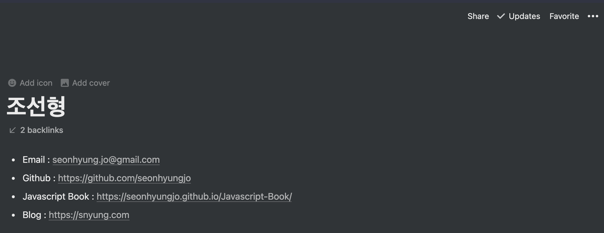
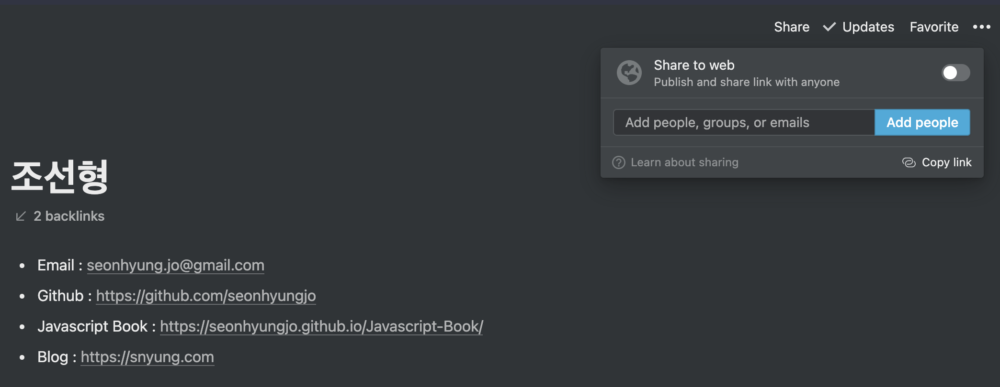
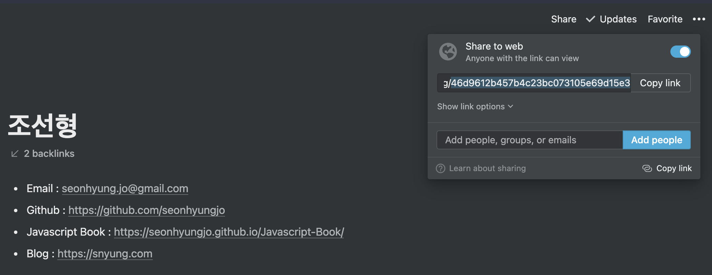
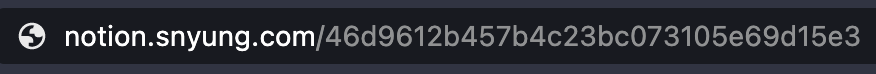

# Notion Site

내가 사용하는 Notion 페이지를 사이트로 만들어주기 프로젝트

누구의 Notion 페이지든 사이트로 보여주기가 가능합니다.

## 이력서 사이트

[sNyung 이력서 페이지(업데이트 중)](https://notion.snyung.com/46d9612b457b4c23bc073105e69d15e3)

## 구성

> notion.snyung.com/{pageId}

- pageId : 공개처리한 페이지 id

## 내 Notion 페이지으로 해보기

### 준비물

1. 공개 되어있는 Notion pageId(끝)

### 순서

#### 1. Notion 페이지 만들기

#### 2. Notion 페이지 공개처리

#### 3. Notion 페이지 ID 복사하기

#### 4. 사이트에서 호출하기

## 예시 사이트

### 에이블리 

https://notion.snyung.com/ce3b5a9eb580480e91044e4cc9dfb527

### 지그재그 

https://notion.snyung.com/a561a88ad03e4022860924fd557a0da3

### 모두의연구소 

https://notion.snyung.com/ddb3366aaf5747f99413d6228b852648

### 마이리얼트립

https://notion.snyung.com/1bf4d38a912649b4b23609e8e8bc2aef

### flex

https://notion.snyung.com/flex-team-2b27d869c39849e7a569e9af76bdc02c

### 당근마켓

https://notion.snyung.com/3d0197c137ec43d18ff739b5b254a3c8

Written by [@sNyung](https://github.com/SeonHyungJo) 🐭
